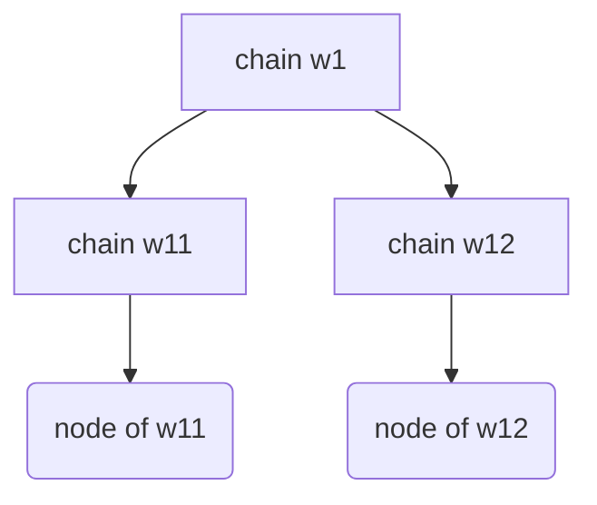

# 资产转移实验

## 实验介绍



实验使用的网络由1个父链，2个子链组成。每个子链有一个叶子节点，共2个节点；叶子节点负责挖矿和发送交易。

该实验将w11子链中的账户的资产转移到w12子链中的同名账户中去，并对该过程计时。

**该实验的各个步骤具有非常强的先后顺序关系，若顺序颠倒，可能造成实验失败乃至地球大爆炸的恶劣后果！！**

## 操作流程

### 配置geth-tree二进制文件

找到本实验目录中的`geth-tree`二进制文件，然后打开一个终端执行以下命令，将其添加到`/usr/bin`目录中：

```bash
sudo rm -f /usr/bin/geth-tree
sudo cp geth-tree /usr/bin/
```

### 启动父链w1

**在启动之前，务必确认没有`geth_w1/gethdata/geth`目录。若有或者实验出错，请将其删除之后继续实验。** 可以使用笔者编写的`delete_gethdata_geth.sh`小脚本一键干翻这些目录。

启动一个终端，切换目录到实验目录的`test_file/`目录下，执行：

```bash
sh w1_init.sh
```

留意控制台的输出中有这么一句话：

```bash
INFO [04-10|20:36:48.833] Started P2P networking                   self="enode://ba9638ca12a44ecac02b78316327a87d4e610927dc8ee9790b28883da88a3d0d45a02bcc390838e2612dc7721de7ae3ea8abed2ae83c5b5dc3f830b1691f714e@127.0.0.1:30309?discport=0"
```

妥善记录`self=`后面的字符串，因为**每一次启动w1,这个enode信息都可能改变！**

### 配置w11和w12的预加载脚本

> 笔者更新了update_enode.py脚本，如果有Python环境并且安装了requests库，可以使用这个脚本替代下方的手动配置过程。Python安装库的方法请自行上网搜索。

打开`test_file/w11_addPeer.js`，将第一行的`admin.addPeer(...)`的括号内部替换为上一步中记录的`self=`后面的字符串（包含双引号）。对`test_file/w12_addPeer.js`也是如此。此处，**必须保证`admin.addPeer(...)`位于两份脚本的第一行！**

### 启动w11子链和w12子链

在继续之前，**务必检查`geth_w11/gethdata/geth`和`geth_w12/gethdata/geth`目录不存在。如果存在或者实验出错，请将它们删除再继续实验。** 可以使用笔者编写的`delete_gethdata_geth.sh`小脚本一键干翻这些目录。

另打开两个终端，分别执行`sh w11_init.sh`和`sh w12_init.sh`。等待，直至在运行w11的终端看到带有“commit... success”的字样：

```js
INFO [04-10|20:54:02.335] Block synchronisation started 
---k:aaaaaaaaaaaaw1,v.RegionId:w1,v.Number:1---
---parent.Number:0, branchb.RegionId:w1,ptd:131072---
!!commitBranchBlock[aaaaaaaaaaaaw1][1]--[td:262144]success!!
```

同理，在w12中应该也会看到类似的字样：

```js
INFO [04-10|20:54:02.831] Block synchronisation started 
---k:aaaaaaaaaaaaw1,v.RegionId:w1,v.Number:1---
---parent.Number:0, branchb.RegionId:w1,ptd:131072---
!!commitBranchBlock[aaaaaaaaaaaaw1][1]--[td:262144]success!!
```

在w1的控制台中，则应该看到这样带有“Import new chain segment”的字样：

```js
INFO [04-10|20:53:58.834] Branch Block synchronisation started 
INFO [04-10|20:54:13.423] Imported new chain segment               blocks=1 txs=0 mgas=0.000 elapsed=5.344ms mgasps=0.000 number=2 regionid="[119 49 49]" hash=a8f841…a1edc5 age=54y2w3d dirty=509.00B   rdirty=0.00B
INFO [04-10|20:54:13.438] Imported new chain segment               blocks=1 txs=0 mgas=0.000 elapsed=8.084ms mgasps=0.000 number=2 regionid="[119 49 50]" hash=a30ab8…b7ddca age=54y2w3d dirty=509.00B   rdirty=0.00B
```

出现这些字样，说明父链已经和子链建立连接且完成同步，这时候才可以继续往下做实验。

### 启动branchnode监控程序

新开启一个终端，运行`node branchnode-remastered.js`即可。

### 启动叶子节点挖矿

在运行着w11和w12的终端中，执行`miner.start(1)`。
miner.start(2)
### 开始资产转移
miner.stop()
资产转移一共分为两个步骤，**务必按照先后顺序进行操作**。

1. 新开一个终端，执行`node transfer_test_step1.js`。耐心等待脚本执行完毕，然后在运行w11的终端中使用以下指令确认转账所用的“手续费”已经划入w11的各个账户中了：
    ```js
    for (var i = 0; i < eth.accounts.length; i++) { console.log(eth.getBalance(eth.accounts[i])) }
    /* 输出如下：
    5e+40
    10000
    5.0000000000000000000168e+40
    0
    10000
    10000
    10000
    10000
    10000
    10000
    10000
    10000
    10000
    null
    */
    ```
2. 在该终端中，继续执行`node transfer_test_step2.js`。等待，直至运转着`branchnode-remastered.js`的终端**仅仅**输出形似
    ```
    line:--handler-TX_request--
    last:false
    3--counter1: 数字
    3--counter2: 数字
    ```
    的结果，再无其他输出，然后在w12中查询各个账户的余额：
   ```js
    for (var i = 0; i < eth.accounts.length; i++) { console.log(eth.getBalance(eth.accounts[i])) }
    /* 输出如下：
    4.999999999999999999999999999999999992e+40
    10000
    5.0000000000000000000086e+40
    0
    10000
    10000
    10000
    10000
    10000
    10000
    10000
    10000
    10000
    null
    */
    ```


## 数据统计

在完成资产转移后，不退出子链，执行`query_transfer_time_w11_w12.js`，完成特殊交易时间统计。

统计结果记录在`tx_request_w11.txt`，`tx_request_w12.txt`，`tx_reslult_w11.txt`，`tx_reslult_w12.txt`中。

## 存在问题

- [x] `branchnode.js`读文件问题,读到某个位置后会从头读,需要完善(笔者编写的`branchnode-remastered.js`了解决这一问题)

- [x] `transfer_test.js`中,目前需要手动选择,如果能够设定顺序执行,可以一起完成（笔者将其拆分成了`transfer_test_step1.js`和`transfer_test_step2.js`两个脚本，人为地控制先后顺序执行）

