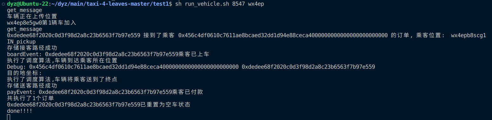
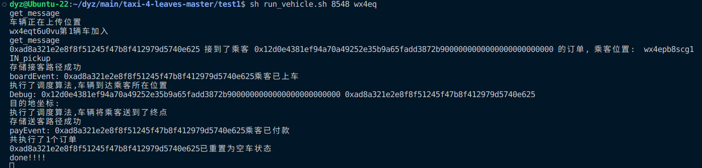
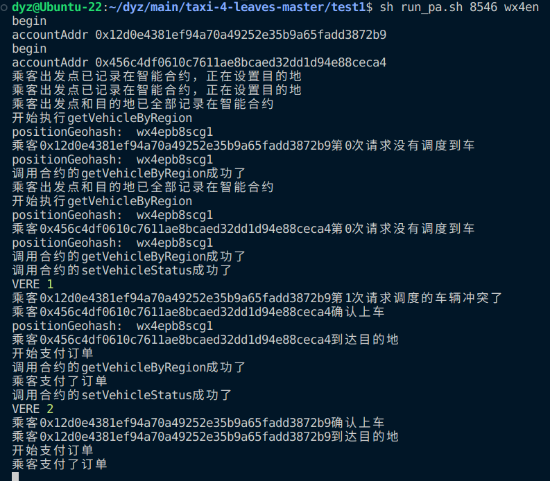

# test1：完成跨地区之间的调度测试
正如之前4章中所做的实验，现有的基于区域搜索的树状区块链可以完成一条虚拟父链之下的多个子链内部的并行调度操作。

本章整体将完成将转账交易应用到调度系统的测试，因此，第一小节便先来实现乘客与车辆在不同子链上的测试实验。

整体实验仓库基于第4章的实验进行，实验在真实世界地图中 Geohash 编码前缀为wx4e的区域下进行。树状区块链部分的实验在该区域下的细分区域 wx4en、wx4ep、wx4eq和wx4er区域下进行。每个区域中，均存在 16 位司机和32位乘客，所有司机的初始位置均相同，所有乘客的出发地点和目的地也相同。以上地点的选点工作基于蒙思洁完成的真实地图信息提取与筛选工作进行，已提前确保选择的路线可以在真实世界地图上导航成功。

本节测试依然使用JavaScript脚本模拟司乘交互行为。需要对第四章中脚本进行相应修改

本章内容整体上，对测试脚本以及智能合约均做了修改。

## 使用步骤记录

1. 执行`python3 GenerateAccountInfo.py`准备测试集，其中`account_use_count`变量意为参与测试的账号数量，可以在不越界的前提下任意指定(这里以12为例：即4个链中，每个链都有两个乘客和一个司机)
2. 执行`sh clear.sh`清理上次运行的痕迹
3. 执行`sh wx4e_init.sh`开启父链
4. 运行`python3 UpdateEnode.py`更新子链的预加载脚本
5. 执行`sh wx4en_init.sh`, `sh wx4ep_init.sh`, `sh wx4eq_init.sh`
6. 把contracts_abi_wx4.txt里的内容复制到各个子链控制台中，部署合约
7. 上传地图（可选，不上传只会影响寻路算法，其他功能全部正常）
8. 启动挖矿。**注意**：本仓库内进行的所有实验全部
9.  执行`sh run_vehicle.sh 8547 wx4ep`（wx4ep链上部署车辆）
    执行`sh run_vehicle.sh 8548 wx4eq`（wx4eq链上部署车辆）
    然后执行`sh run_passenger.sh 8546 wx4en`在wx4en上部署乘客，wx4en调度活动开始

10. 结果记录在log_passenger_wx4e?.log、log_vehicle_wx4e?.log、passengers_result_wx4e?.json、vehicles_result_wx4e?.json中

## 实验结果截图

