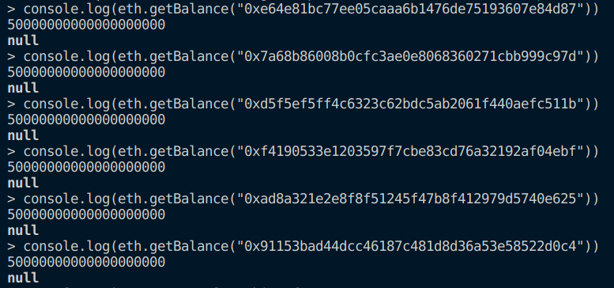
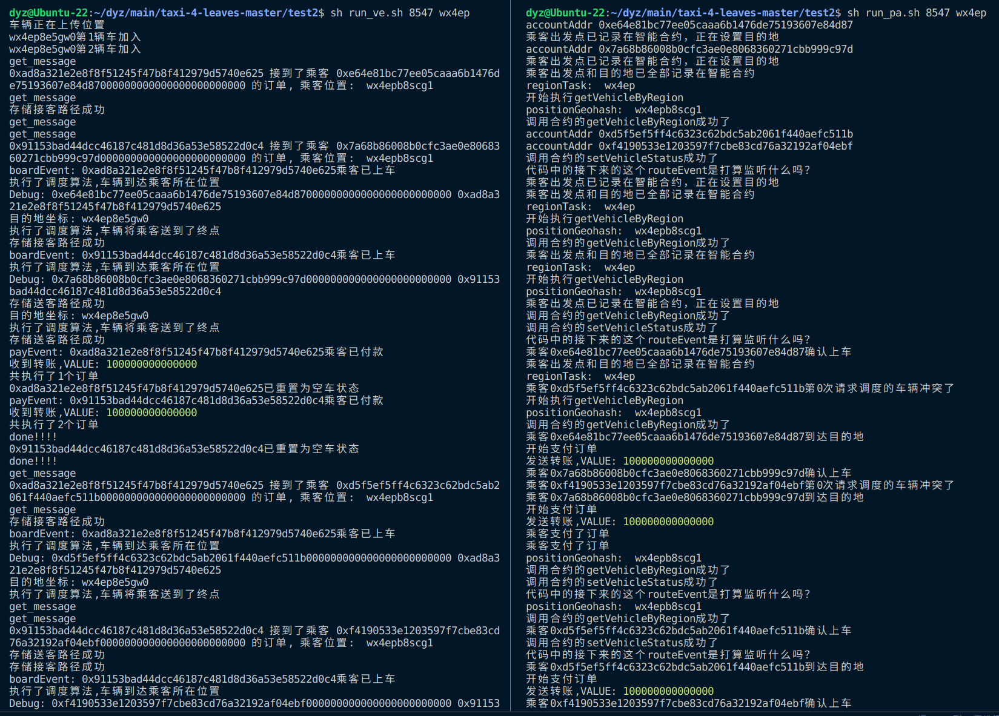
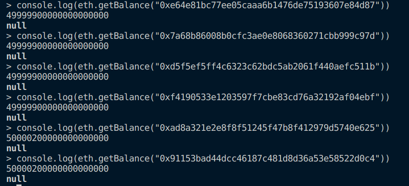

# test2：实验同地区之间交易的转账测试
在第四章以及第一小节的实验中均不包含交易转账操作，因此，本小节笔者主要需要基于现有的出租车调度系统的测试代码，添加调度之间的交易测试。

本节测试依然使用JavaScript脚本模拟司乘交互行为。需要对脚本进行相应修改

## 使用步骤记录

1. 执行`python3 GenerateAccountInfo.py`准备测试集，其中`account_use_count`变量意为参与测试的账号数量，可以在不越界的前提下任意指定(这里以24为例：即4个链中，每个链都有4个乘客和2个司机)
2. 执行`sh clear.sh`清理上次运行的痕迹
3. 执行`sh wx4e_init.sh`开启父链
4. 运行`python3 UpdateEnode.py`更新子链的预加载脚本
5. 执行`sh wx4ep_init.sh`
6. 把contracts_abi_wx4.txt里的内容复制到各个子链控制台中，部署合约
7. 上传地图（可选，不上传只会影响寻路算法，其他功能全部正常）
8. 在控制台中输入eth.getBalance("账户")，提前确认车辆及乘客余额
9. 启动挖矿。**注意**：本仓库内进行的所有实验全部
10. 执行`sh run_vehicle.sh 8547 wx4ep`（wx4ep链上部署车辆）
    然后执行`sh run_passenger.sh 8547 wx4ep`在wx4ep上部署乘客，wx4en调度活动开始
11. 结果记录在log_passenger_wx4e?.log、log_vehicle_wx4e?.log、passengers_result_wx4e?.json、vehicles_result_wx4e?.json中
12. 在控制台中输入eth.getBalance("账户")，确认车辆及乘客余额，此时余额为未转账的情况
13. 重启实验重复上述过程(**重置初始金额**)
14. 执行`sh run_ve.sh 8547 wx4ep`（wx4en链上部署车辆）
    然后执行`sh run_pa.sh 8547 wx4ep`在wx4en上部署乘客，wx4en调度活动开始
15. 在控制台中输入eth.getBalance("账户")，确认车辆及乘客余额，此时余额为转账过的情况
16. 对比车辆余额即可发现，转账测试成功

## 实验结果截图

