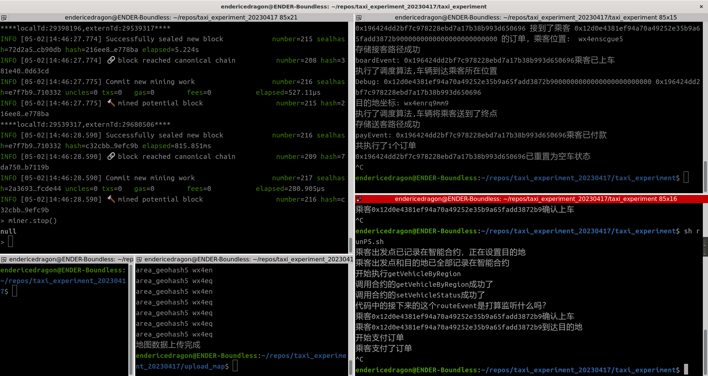

# 关于地图数据

笔者使用的地图数据均来自[蒙思洁同学的仓库](https://gitee.com/lancerenk/graduation-design/tree/master/RealBjMap)。为给司机和乘客指定初始位置，我们需要在地图上选择一条连通的路径，标记其端点坐标为A和B，并如此设置司乘的初始位置：

- 乘客初始位置设置为A
- 乘客的目的地设置为B
- 司机的初始位置设置为A或B

借助[Geohash Explorer](https://geohash.softeng.co/)，我们可以将Geohash编码和真实世界的地图对应起来。这有助于我们找到合适的公交站点。

## 探索wx4en区域

以下探索基于Geohash Explorer和蒙思洁同学的仓库中的地图数据进行。

笔者计划寻找一条从首都师范大学(大致位置wx4ensc)前往北京化工大学(大致位置wx4enrq)的线路。在out_wx4en.json中分别搜索二者的大致位置，找到这样一条路：

```json
{"properties":{"minzoom":7,"highway":"tertiary","cost":67,"gid":108034,"name":"西三环北路","source":18262,"target":18262,"oneway":"yes"},"geometry":{"coordinates":["wx4enscgue5","wx4enscbk6j"],"type":"LineString"},"type":"Feature"}

{"properties":{"minzoom":7,"highway":"tertiary","cost":103,"gid":121078,"name":"紫竹院路","source":20405,"target":20364,"oneway":"yes"},"geometry":{"coordinates":["wx4enrq9mm9","wx4enrprnep"],"type":"LineString"},"type":"Feature"}
```

因此可以选定wx4enscgue5为乘客出发点，wx4enrq9mm9为乘客终点，出租车初始位置则设置为乘客终点。

使用out_wx4en.json和选定的起止地点在出租车调度系统中试运行，获得下图结果：



能够成功调度，并且在检查vehicles.js输出的日志时发现，寻路算法工作正常，给出了从北京化工大学出发接上乘客后再开向北京化工大学的线路：

```json
[{"passengerId":"0x12d0e4381ef94a70a49252e35b9a65fadd3872b9000000000000000000000000","passengerGeohash":"wx4enscgue5","vehicleId":"0x196424dd2bf7c978228ebd7a17b38b993d650696","vehicleStartPosition":"wx4enrq9mm9","emptyAstarTime":209,"emptyRoute":["wx4enrq9mm9","wx4enrprnep","wx4enx0j5q9","wx4enwcu6xm","wx4enwcfff3","wx4enwcbffv","wx4enw9fe6u","wx4enw9c580","wx4enw9be98","wx4enw1v5n2","wx4entcz6tn","wx4entcy4tu","wx4entcbs15","wx4ent3vjn4","wx4ent3ujj3","wx4ent3gm58","wx4ent3chuy","wx4ent3bsbm","wx4ent1zsyh","wx4ent1zhcu","wx4ent1ykgn","wx4ent1yhfq","wx4ent1vkyw","wx4ent1gjnm","wx4enscgue5"],"emptyRouteTime":0,"emptyCountFrag":25,"endGeohash":"wx4enrq9mm9","loadAstarTime":996,"loadRoute":["wx4enscgue5","wx4enscbk6j","wx4ens3yuj5","wx4ens3ykp7","wx4ens3yhjs","wx4ens1vsc0","wx4ens1gkf6","wx4ens1fhb5","wx4ens1buyk","wx4enecysgw","wx4enecvszx","wx4enec6vz1","wx4enec6sxd","wx4enec1z2z","wx4enec097u","wx4enebbn37","wx4ene8rcqj","wx4ene8punn","wx4en7xryu7","wx4en7tzdz2","wx4en7extfu","wx4en7ex94g","wx4en7ert52","wx4en7dxtyf","wx4en79zyfx","wx4en79rftf","wx4en7c2dse","wx4enk0fzw1","wx4enk0zqsv","wx4enk0zye4","wx4enk2bqqq","wx4enk2fvyy","wx4enk8cmmd","wx4enk8gc4d","wx4enm0wq47","wx4enm0wyn2","wx4enm0xtum","wx4enm28mcc","wx4enm8e7y5","wx4enm8teqj","wx4enq23xt4","wx4enq82kvu","wx4enq8r1xz","wx4enr0jd9u","wx4enprvphp","wx4enpxgk1m","wx4enpz8yry","wx4enpztjtz","wx4enpzuf37","wx4enpzuqqh","wx4enpzure1","wx4enrbh0z9","wx4enrb5xp6","wx4enrbdskq","wx4enrs21cr","wx4enrkrwjp","wx4enrmjrs7","wx4enrmky3w","wx4enrmsk8r","wx4enrq6hw6","wx4enrq6n1w","wx4enrq9mm9"],"loadRouteTime":0,"loadCountFrag":62}]
```

## 探索wx4ep区域

和探索wx4en过程类似。笔者计划寻找从月坛公园(wx4epd9)出发前往民族饭店(wx4epbe)的路径。经过搜索，获得以下两条信息：

```json
{"properties":{"minzoom":7,"highway":"secondary","cost":241,"gid":95798,"name":"月坛北街","source":19670,"target":16454,"oneway":"yes"},"geometry":{"coordinates":["wx4epdew0gp","wx4epd9qp1m"],"type":"LineString"},"type":"Feature"}

{"properties":{"minzoom":7,"highway":"primary","cost":72,"gid":80802,"name":"复兴门内大街","source":14654,"target":14661,"oneway":"yes"},"geometry":{"coordinates":["wx4epbdefbu","wx4epbe5y91"],"type":"LineString"},"type":"Feature"}
```

因此可以选定wx4epd9qp1m为乘客出发点和车辆初始位置，wx4epbe5y91为乘客终点。

使用以上数据进行调度测试，获得寻路结果如下：

```json
[{"passengerId":"0x12d0e4381ef94a70a49252e35b9a65fadd3872b9000000000000000000000000","passengerGeohash":"wx4epd9qp1m","vehicleId":"0x196424dd2bf7c978228ebd7a17b38b993d650696","vehicleStartPosition":"wx4epd9qp1m","emptyAstarTime":0,"emptyRoute":[],"emptyRouteTime":0,"emptyCountFrag":0,"endGeohash":"wx4epbe5y91","loadAstarTime":681,"loadRoute":["wx4epd9qp1m","wx4ep6xty5k","wx4ep6wtcdx","wx4ep6smy5s","wx4ep6emejn","wx4ep6ejxtf","wx4ep6ehzyu","wx4ep65m5uv","wx4ep65kkpb","wx4ep3gkwnk","wx4ep3gkqjw","wx4ep3g7wkd","wx4ep3ge9k8","wx4ep3u7ebr","wx4ep3y7r4d","wx4ep9c5ng1","wx4ep9fdvw8","wx4ep9gdvvw","wx4ep9gfctu","wx4ep9gfcek","wx4ep9eufmf","wx4ep978xmc","wx4ep95xzh8","wx4ep8gesc5","wx4ep8ett3d","wx4ep8esvk5","wx4ep8esjmv","wx4ep8eevmq","wx4ep8egbj3","wx4ep8egftm","wx4ep8eguv6","wx4ep8s5cjq","wx4ep8s7gv1","wx4ep8t7vs6","wx4ep8tgc5y","wx4ep8wgyg3","wx4epb85u54","wx4epb8ecep","wx4epb8ev6c","wx4epbdefbu","wx4epbe5y91"],"loadRouteTime":0,"loadCountFrag":41}]
```

## 探索wx4eq区域

笔者计划寻找一条从北京理工大学(wx4eq9)前往中关村购物广场(wx4eqw)的线路。搜索，获得以下信息：

```json
{"properties":{"minzoom":7,"highway":"tertiary","cost":78,"gid":132620,"name":"西三环北路","source":21024,"target":21024,"oneway":"yes"},"geometry":{"coordinates":["wx4eq9c46h2","wx4eq99nmeb"],"type":"LineString"},"type":"Feature"}

{"properties":{"minzoom":7,"highway":"tertiary","cost":77,"gid":151159,"name":"海淀中街","source":21906,"target":21939,"oneway":"yes"},"geometry":{"coordinates":["wx4eqtfwqmk","wx4eqw4dqx5"],"type":"LineString"},"type":"Feature"}
```

因此，可以选择 wx4eq9c46h2 作为乘客出发点和车辆初始位置， wx4eqw4dqx5 作为乘客终点。调度结果如下：

```json
[{"passengerId":"0x12d0e4381ef94a70a49252e35b9a65fadd3872b9000000000000000000000000","passengerGeohash":"wx4eqw4dqx5","vehicleId":"0x196424dd2bf7c978228ebd7a17b38b993d650696","vehicleStartPosition":"wx4eqw4dqx5","emptyAstarTime":0,"emptyRoute":[],"emptyRouteTime":0,"emptyCountFrag":0,"endGeohash":"wx4eq9c46h2","loadAstarTime":707,"loadRoute":["wx4eqw4dqx5","wx4eqw6dxjb","wx4eqw6enfs","wx4eqw6eh8v","wx4eqw6dssj","wx4eqtfwk7k","wx4eqtfwhkh","wx4eqtftu6k","wx4eqtfskt2","wx4eqtdwmgg","wx4eqtdtyhc","wx4eqtd8rsv","wx4eqt6xzz3","wx4eqt6xxfu","wx4eqt6vb3v","wx4eqt6u0vu","wx4eqt4vdf6","wx4eqt4v4vx","wx4eqt1uumx","wx4eqt1kc34","wx4eqt1kb2y","wx4eqt1hvb5","wx4eqt1hdr0","wx4eqt0h89q","wx4eqmpujvc","wx4eqmpk5fs","wx4eqmphpbj","wx4eqmp5uwn","wx4eqmp5kvg","wx4eqmp4uzp","wx4eqmp4t17","wx4eqkx7k9t","wx4eqkre02f","wx4eqkpx19s","wx4eqkpw9bd","wx4eqkpsd7n","wx4eqkpeb6u","wx4eqkp7nt6","wx4eqkpd8b4","wx4eqkp9k5y","wx4eq7zwr1f","wx4eq7xfjpr","wx4eq7rzqer","wx4eq7rcy9e","wx4eqe0j99n","wx4eqdb3e0w","wx4eqd8myj4","wx4eqd8mq86","wx4eqd8kqgh","wx4eqd87yyn","wx4eqd87yfq","wx4eqd0xqjg","wx4eqd0u9j2","wx4eq9c46h2"],"loadRouteTime":0,"loadCountFrag":54}]
```

## 探索wx4er区域

笔者设计一条从北京邮电大学(wx4erd)前往北京航空航天大学学院路校区(wx4erw)的线路。搜索获得：

```json
{"properties":{"minzoom":7,"highway":"trunk","cost":202,"gid":134653,"name":"西直门北大街","source":21051,"target":21155,"oneway":"yes"},"geometry":{"coordinates":["wx4er9fsyeq","wx4erd4xkyz"],"type":"LineString"},"type":"Feature"}

{"properties":{"minzoom":7,"highway":"trunk_link","cost":57,"gid":154398,"name":null,"source":22097,"target":22097,"oneway":"yes"},"geometry":{"coordinates":["wx4erwc6rz6","wx4erw9rmze"],"type":"LineString"},"type":"Feature"}
```

因此，可以令 wx4erd4xkyz 为乘客起点， wx4erw9rmze 为乘客终点。车辆起始位置则设置为乘客终点。调度结果如下：

```json
[{"passengerId":"0x12d0e4381ef94a70a49252e35b9a65fadd3872b9000000000000000000000000","passengerGeohash":"wx4erd4xkyz","vehicleId":"0x196424dd2bf7c978228ebd7a17b38b993d650696","vehicleStartPosition":"wx4erw9rmze","emptyAstarTime":629,"emptyRoute":["wx4erw9rmze","wx4erw9kykg","wx4erw92rrx","wx4erw1weqn","wx4erw1sgyx","wx4ertcwmqg","wx4ertcstvq","wx4ertc8tq5","wx4ert3y94x","wx4ert3dvwu","wx4ert3919s","wx4ert382xu","wx4ert1rzt9","wx4ert1rqt0","wx4ert1qs8z","wx4ersc4eu1","wx4ers9kbky","wx4ers938g2","wx4ers37cr9","wx4ers17g9p","wx4ers17g8z","wx4ers16k2x","wx4erec92dz","wx4ere9w0up","wx4ere9w102","wx4ere9tc1b","wx4ere9t1j4","wx4ere9s90k","wx4ere9echm","wx4ere9e91n","wx4ere3wc86","wx4ere1qtrv","wx4ere1qm5h","wx4erd9d0uv","wx4erd3wcx2","wx4erd1xqcg","wx4er9fmtne","wx4er9fmn3u","wx4er9fkytn","wx4er9fkrg3","wx4er9fs5tu","wx4er9fsnbe","wx4er9fswcb","wx4er9fsyeq","wx4erd4xkyz"],"emptyRouteTime":0,"emptyCountFrag":45,"endGeohash":"wx4erw9rmze","loadAstarTime":586,"loadRoute":["wx4erd4xkyz","wx4erd6x7g6","wx4erdd9e66","wx4erdfwb1w","wx4ere4qnfd","wx4ere63y1e","wx4ere6mjke","wx4ered3s6s","wx4ered7s19","wx4ered7gur","wx4eredkebs","wx4eredm5vb","wx4eredmgdu","wx4eredq5s5","wx4eredq784","wx4eref27nw","wx4eref7dvn","wx4erefk6fd","wx4ers42ccg","wx4ers6285m","wx4ersd0qqz","wx4ersf4kr6","wx4ersfnvfw","wx4ert45tp7","wx4ert4jusp","wx4ert4nheh","wx4ert4pkjj","wx4ert4pun0","wx4ert60ebf","wx4ert615es","wx4ert64grx","wx4ertdhc93","wx4ertcbtxk","wx4ertccm50","wx4ertczhj9","wx4erw1yf22","wx4erw3bcb9","wx4erw98wgp","wx4erw9xvq8","wx4erwcekpu","wx4erx19esb","wx4erx1ehjn","wx4erx1sh14","wx4erx1t5bw","wx4erx1kyz6","wx4erx17zpc","wx4erx17p79","wx4erx13wev","wx4erwc7rxm","wx4erwc6rz6","wx4erw9rmze"],"loadRouteTime":0,"loadCountFrag":51}]
```

## 蒙思洁同学的补充工作

蒙思洁同学通过测试，给出了在wx4ep和wx4eq中可以双向导航的路径选点。结合笔者的工作，现将其整理如下：

| Geohash前缀 | 乘客起点    | 乘客终点    | 司机初始位置 |
| ----------- | ----------- | ----------- | ------------ |
| wx4en       | wx4enscgue5 | wx4enrq9mm9 | wx4enrq9mm9  |
| wx4ep       | wx4epb8scg1 | wx4ep8e5gw0 | wx4ep8e5gw0  |
| wx4eq       | wx4eq7rgmxk | wx4eqt6u0vu | wx4eqt6u0vu  |
| wx4er       | wx4erd4xkyz | wx4erw9rmze | wx4erw9rmze  |

# 搭建单父链四子链结构

## 构建父链wx4e

父链结构较为简单，其中仅有一个账号，其公钥地址为0x196424dd2bf7c978228ebd7a17b38b993d650696。大致结构如下所示：

```
geth_wx4e/
├── genesisgtrie.json
└── gethdata
    └── keystore
        ├── UTC--2023-05-03T08-02-37.499183180Z--196424dd2bf7c978228ebd7a17b38b993d650696
```

笔者已经在创世配置文件中，为该账号赋予`5e+40`的余额，并设置其位置为wx4e。

## 构建子链wx4en, wx4ep, wx4eq, wx4er

**注意**：子链想和父链成功同步，就必须保证**子链所使用的创世配置文件和父链完全一样**。

子链中存在多个账号，除父链中的账号外，还需额外的90个账号。在日后的测试中，这其中30个会扮演司机，剩余的60个扮演乘客。每位乘客只发送一次乘车请求，但司机可以接收多个乘车请求。

笔者已经构建好了四个子链各自的文件夹和启动脚本。

## 使用步骤记录

1. 执行`python3 GenerateAccountInfo.py`准备测试集，其中`account_use_count`变量意为参与测试的账号数量，可以在不越界的前提下任意指定
2. 执行`sh clear.sh`清理上次运行的痕迹
3. 执行`sh wx4e_init.sh`开启父链
4. 运行`python3 UpdateEnode.py`更新子链的预加载脚本
5. 执行`sh wx4en_init.sh`等脚本开启子链
6. 把contracts_abi_wx4.txt里的内容复制到各个子链控制台中，部署合约
7. 上传地图（可选，不上传只会影响寻路算法，其他功能全部正常）
8. 启动挖矿。**注意**：本仓库内进行的所有实验全部

sh run_ve.sh 8547 wx4ep
sh run_pa.sh 8546 wx4en
sh run_ve.sh 8548 wx4eq

9.  执行`sh run_vehicle.sh 8546 wx4en`，在wx4en上部署车辆，然后执行`sh run_passenger.sh 8546 wx4en`在wx4en上部署乘客，wx4en调度活动开始
10. 重复上述步骤，为其余三个子链启动调度活动，端口号递增1即可
11. 结果记录在log_passenger_wx4e?.log、log_vehicle_wx4e?.log、passengers_result_wx4e?.json、vehicles_result_wx4e?.json中
12. 若想执行基于geth1的不分块实验，执行`sh wx4e_standalone_init.sh`，随后形似第6步部署合约，然后执行`sh run_vehicle.sh 8550 all`和`sh run_passenger.sh 8550 all`
13. 结果记录在passengers_result_all.json、vehicles_result_all.json中

sh run_pa.sh 8546 wx4en
miner.start(2)
miner.stop()
eth.getAccountByRegion('wx4en')
eth.getAccountByRegion('wx4ep')
for (var i = 0; i < eth.accounts.length; i++) { console.log(eth.getBalance(eth.accounts[i])) }
console.log(eth.getBalance("0x196424dd2bf7c978228ebd7a17b38b993d650696")) 

console.log(eth.getBalance("0xdedee68f2020c0d3f98d2a8c23b6563f7b97e559")) 
console.log(eth.getBalance("0xc0a3917e5679c0ef9033c41cbe294a212abe55df"))
console.log(eth.getBalance("0x55577fd620a0b8379846fcb1499e4bdc22538843"))
console.log(eth.getBalance("0x12d0e4381ef94a70a49252e35b9a65fadd3872b9"))
console.log(eth.getBalance("0x456c4df0610c7611ae8bcaed32dd1d94e88ceca4"))

console.log(eth.getBalance("0xe64e81bc77ee05caaa6b1476de75193607e84d87")) 
console.log(eth.getBalance("0x7a68b86008b0cfc3ae0e8068360271cbb999c97d"))
console.log(eth.getBalance("0xd5f5ef5ff4c6323c62bdc5ab2061f440aefc511b"))
console.log(eth.getBalance("0xf4190533e1203597f7cbe83cd76a32192af04ebf"))
console.log(eth.getBalance("0xad8a321e2e8f8f51245f47b8f412979d5740e625")) 
console.log(eth.getBalance("0x91153bad44dcc46187c481d8d36a53e58522d0c4"))

console.log(eth.getBalance("0x12d0e4381ef94a70a49252e35b9a65fadd3872b9"))
console.log(eth.getBalance("0x456c4df0610c7611ae8bcaed32dd1d94e88ceca4"))
console.log(eth.getBalance("0xdedee68f2020c0d3f98d2a8c23b6563f7b97e559")) 
console.log(eth.getBalance("0xad8a321e2e8f8f51245f47b8f412979d5740e625")) 


console.log(eth.getBalance("0x7a68b86008b0cfc3ae0e8068360271cbb999c97d"))
console.log(eth.getBalance("0xd5f5ef5ff4c6323c62bdc5ab2061f440aefc511b"))
console.log(eth.getBalance("0xd402c7301a68c4c65529ab0c597bb8b13e27f607"))
console.log(eth.getBalance("0x42389309e69a2b32b98f04bc8255ad971797f757"))
console.log(eth.getBalance("0xdedee68f2020c0d3f98d2a8c23b6563f7b97e559"))
console.log(eth.getBalance("0xc0a3917e5679c0ef9033c41cbe294a212abe55df"))
console.log(eth.getBalance("0x55577fd620a0b8379846fcb1499e4bdc22538843"))
console.log(eth.getBalance("0xad8a321e2e8f8f51245f47b8f412979d5740e625"))
console.log(eth.getBalance("0x91153bad44dcc46187c481d8d36a53e58522d0c4"))
console.log(eth.getBalance("0xe64e81bc77ee05caaa6b1476de75193607e84d87"))

> console.log(eth.getBalance("0x7a68b86008b0cfc3ae0e8068360271cbb999c97d"))
50000000000000000000
null
> console.log(eth.getBalance("0xd5f5ef5ff4c6323c62bdc5ab2061f440aefc511b"))
50000000000000000000
null
> console.log(eth.getBalance("0xd402c7301a68c4c65529ab0c597bb8b13e27f607"))
5e+40
null
> console.log(eth.getBalance("0x42389309e69a2b32b98f04bc8255ad971797f757"))
5e+40
null
> console.log(eth.getBalance("0xdedee68f2020c0d3f98d2a8c23b6563f7b97e559"))
49998851463000000000
null
> console.log(eth.getBalance("0xc0a3917e5679c0ef9033c41cbe294a212abe55df"))
49998866463000000000
null
> console.log(eth.getBalance("0x55577fd620a0b8379846fcb1499e4bdc22538843"))
49998866463000000000
null
> console.log(eth.getBalance("0xad8a321e2e8f8f51245f47b8f412979d5740e625"))
49998866463000000000
null
> console.log(eth.getBalance("0x91153bad44dcc46187c481d8d36a53e58522d0c4"))
49998866463000000000
null
> console.log(eth.getBalance("0xe64e81bc77ee05caaa6b1476de75193607e84d87"))
49998866463000000000
null


> console.log(eth.getBalance("0x7a68b86008b0cfc3ae0e8068360271cbb999c97d"))
50000907848000000000
null
> console.log(eth.getBalance("0xd5f5ef5ff4c6323c62bdc5ab2061f440aefc511b"))
50001892848000000000
null
> console.log(eth.getBalance("0xd402c7301a68c4c65529ab0c597bb8b13e27f607"))
5e+40
null
> console.log(eth.getBalance("0x42389309e69a2b32b98f04bc8255ad971797f757"))
5e+40
null
> console.log(eth.getBalance("0xdedee68f2020c0d3f98d2a8c23b6563f7b97e559"))
50000000000000000000
null
> console.log(eth.getBalance("0xc0a3917e5679c0ef9033c41cbe294a212abe55df"))
50000000000000000000
null
> console.log(eth.getBalance("0x55577fd620a0b8379846fcb1499e4bdc22538843"))
50000000000000000000
null
> console.log(eth.getBalance("0xad8a321e2e8f8f51245f47b8f412979d5740e625"))
50000000000000000000
null
> console.log(eth.getBalance("0x91153bad44dcc46187c481d8d36a53e58522d0c4"))
50000000000000000000
null
> console.log(eth.getBalance("0xe64e81bc77ee05caaa6b1476de75193607e84d87"))
50000000000000000000
null


> console.log(eth.getBalance("0x7a68b86008b0cfc3ae0e8068360271cbb999c97d"))
50000000000000000000
null
> console.log(eth.getBalance("0xd5f5ef5ff4c6323c62bdc5ab2061f440aefc511b"))
50000000000000000000
null
> console.log(eth.getBalance("0xd402c7301a68c4c65529ab0c597bb8b13e27f607"))
5.0000000000000000000000000907848e+40
null
> console.log(eth.getBalance("0x42389309e69a2b32b98f04bc8255ad971797f757"))
5.0000000000000000000000001892848e+40
null
> console.log(eth.getBalance("0xdedee68f2020c0d3f98d2a8c23b6563f7b97e559"))
50000000000000000000
null
> console.log(eth.getBalance("0xc0a3917e5679c0ef9033c41cbe294a212abe55df"))
50000000000000000000
null
> console.log(eth.getBalance("0x55577fd620a0b8379846fcb1499e4bdc22538843"))
50000000000000000000
null
> console.log(eth.getBalance("0xad8a321e2e8f8f51245f47b8f412979d5740e625"))
50000000000000000000
null
> console.log(eth.getBalance("0x91153bad44dcc46187c481d8d36a53e58522d0c4"))
50000000000000000000
null
> console.log(eth.getBalance("0xe64e81bc77ee05caaa6b1476de75193607e84d87"))
50000000000000000000
null
> 