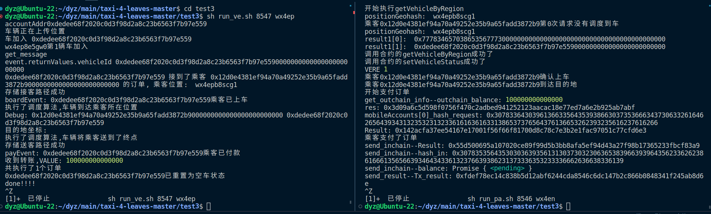
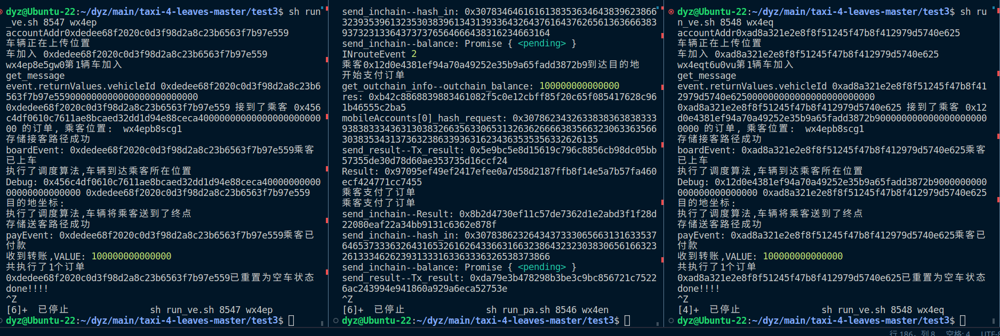
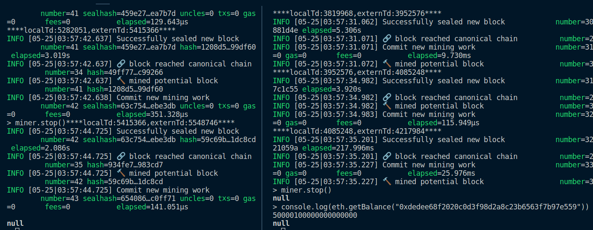

# test4：实验不同地区之间的交易转账测试

将上述测试脚本的运行逻辑进行改进，使得整个过程都是基于合约中的事件来触发，使得整体过程更趋于实际的应用过程，并且将该过程由合约封装后，在实际的高负载应用中使得交易更有条理；将转账的操作由合约来执行作为内部功能。

完成此改动后，进行大规模的测试

本节测试依然使用JavaScript脚本模拟司乘交互行为。需要对脚本进行相应修改

## 使用步骤记录

1. 执行`python3 GenerateAccountInfo.py`准备测试集，其中`account_use_count`变量意为参与测试的账号数量，可以在不越界的前提下任意指定(这里以12为例：即4个链中，每个链都有两个乘客和一个司机)
2. 执行`sh clear.sh`清理上次运行的痕迹
3. 执行`sh wx4e_init.sh`开启父链
4. 运行`python3 UpdateEnode.py`更新子链的预加载脚本
5. 执行`sh wx4en_init.sh`, `sh wx4ep_init.sh`, `sh wx4eq_init.sh`
6. 把contracts_abi_wx4.txt里的内容复制到各个子链控制台中，部署合约
7. 上传地图（可选，不上传只会影响寻路算法，其他功能全部正常）
8. 启动挖矿。**注意**：本仓库内进行的所有实验全部
9.  执行`sh run_vehicle.sh 8547 wx4ep`（wx4ep链上部署车辆）
    执行`sh run_vehicle.sh 8548 wx4eq`（wx4eq链上部署车辆）
    然后执行`sh run_passenger.sh 8546 wx4en`在wx4en上部署乘客，wx4en调度活动开始

10. 结果记录在log_passenger_wx4e?.log、log_vehicle_wx4e?.log、passengers_result_wx4e?.json、vehicles_result_wx4e?.json中

## 实验结果截图

